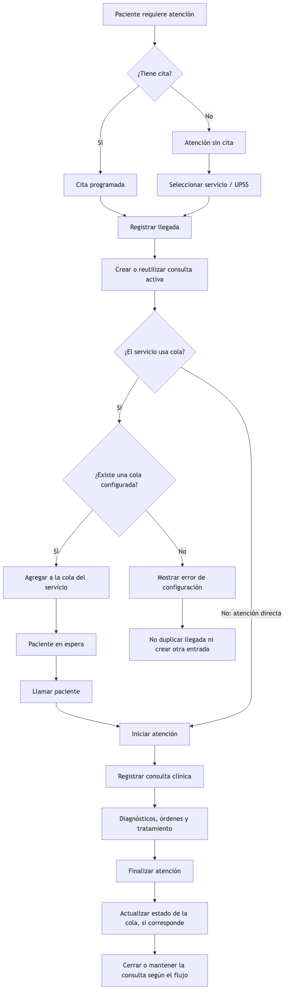
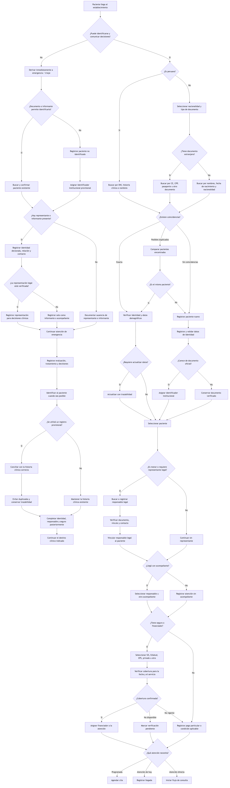

# Flujos operativos

## Citas, consultas y colas

Flujo de atención programada, sin cita y directa, con uso configurable de colas por servicio.

[Fuente Mermaid](./citas-consultas-colas.mmd)

## Identificación y registro del paciente

Flujo de identificación para pacientes peruanos, extranjeros, menores de edad o con representante legal; incluye acompañante, seguro y atención de emergencia cuando la persona no puede identificarse o comunicar decisiones.

[Fuente Mermaid](./identificacion-registro-paciente.mmd)

